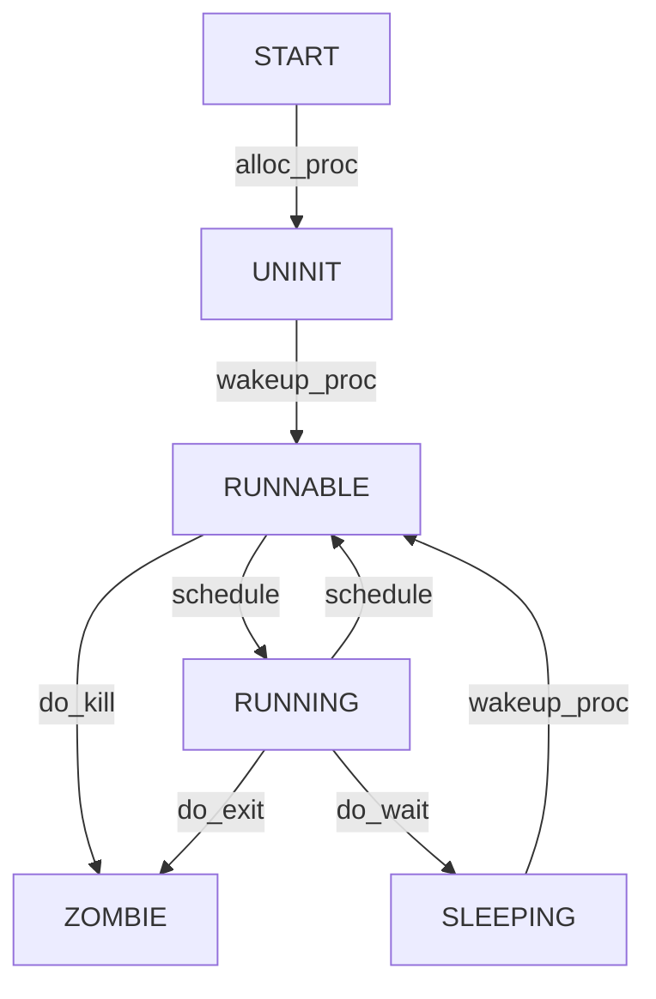

# Lab5：用户程序  

对实验报告的要求： 

- 基于markdown格式来完成，以文本方式为主
- 填写各个基本练习中要求完成的报告内容
- 列出你认为本实验中重要的知识点，以及与对应的OS原理中的知识点，并简要说明你对二者的含义，关系，差异等方面的理解（也可能出现实验中的知识点没有对应的原理知识点）
- 列出你认为OS原理中很重要，但在实验中没有对应上的知识点

#### 练习0：填写已有实验

本实验依赖实验2/3/4。请把你做的实验2/3/4的代码填入本实验中代码中有“LAB2”/“LAB3”/“LAB4”的注释相应部分。注意：为了能够正确执行lab5的测试应用程序，可能需对已完成的实验2/3/4的代码进行进一步改进。

1. 更新 `alloc_proc` 函数，对 PCB 中新增的成员变量 `wait_state, cptr, yptr, optr` 初始化：

- `wait_state`：进程等待状态
- `cptr`：进程的 children
- `optr`：进程的 old sibling
- `yptr`：进程的 young sibling

在原来代码的基础上新增两行：

```c++
proc->wait_state = 0;
proc->cptr = proc->yptr = proc->optr = NULL;
```

2. 更新 `do_fork` 函数：

- 确保当前进程正在等待
- 将原来的计数改成 `set_links` 函数

查看 `set_links` 函数：

```c++
static void
set_links(struct proc_struct *proc) {
    list_add(&proc_list, &(proc->list_link));
    proc->yptr = NULL;
    if ((proc->optr = proc->parent->cptr) != NULL) {
        proc->optr->yptr = proc;
    }
    proc->parent->cptr = proc;
    nr_process ++;
}
```

可以看出，它在原来单纯增加计数的基础上，设置了当前进程的 process relations。

在原来代码的基础上新增两行：

```c++
assert(current->wait_state == 0); // 新增
//other codes
bool intr_flag;
local_intr_save(intr_flag);
{
    proc->pid = get_pid();
    hash_proc(proc);
    set_links(proc); // 新增，由于 set_links 函数里调用了 list_add，把原来此处的调用也删掉
}
local_intr_restore(intr_flag);
```

#### 练习1: 加载应用程序并执行（需要编码）

`do_execve` 函数调用 `load_icode`（位于 `kern/process/proc.c` 中）来加载并解析一个处于内存中的ELF执行文件格式的应用程序。你需要补充 `load_icode` 的第6步，建立相应的用户内存空间来放置应用程序的代码段、数据段等，且要设置好 `proc_struct` 结构中的成员变量 trapframe 中的内容，确保在执行此进程后，能够从应用程序设定的起始执行地址开始执行。需设置正确的 trapframe 内容。

请在实验报告中简要说明你的设计实现过程。

`load_icode` 函数的主要工作是给用户进程建立一个能让它正常运行的用户环境：  
1. 内存管理准备：调用 `mm_create` 申请进程的内存管理数据结构 mm 所需空间，并初始化；
2. 创建进程的页目录表：调用 `setup_pgdir` 为页目录表申请一个页的内存，将内核页表 copy 到这个目录表里，让 mm->pgdir 指向它；
3. 建立进程的用户态虚拟地址空间，将执行码和数据放到内存里：根据执行码的起始位置解析 ELF 格式的执行程序，调用 `mm_map` 函数根据 TXT/DATA/BSS 段的起始位置和大小建立 vma，插入 mm；分配物理内存空间，确定虚拟地址，在页表里建立映射关系，把段的内容 copy 到虚拟内存中；
4. 设置用户栈：调用 `mm_map` 建立用户栈的 vma，放在用户虚拟地址空间的顶端，分配物理内存，建立映射关系；
5. 更新用户进程的虚拟内存空间：mm->pgdir 赋值给 cr3，此时 initproc 已经被当前进程的代码和数据覆盖，成为第一个用户进程，但执行现场还没有建立好；
6. 清空后重新设置进程的 trapframe，使得执行中断返回指令 iret 后，CPU 会切换回用户态，跳转到用户进程的第一条指令执行，并确保在用户态可以响应中断。

此处填写的是第6步，即伪造中断返回现场，需要设置 trapframe：

- gpr.sp 指向先前创建的用户栈的栈顶；
- epc 指向 ELF 文件加载到内存之后的入口；
- 设置 sstatus，需要用到 SPP 和 SPIE，前者表明进入用户态之前的模式（若之前是用户态则为0，其他为1），后者表明进入用户态之前的中断使能情况；为了确保在用户态可以响应中断，需要将原来的 sstatus & ~(SPP | SPIE)。

在 `load_icode` 中增加代码如下：

```c++
tf->gpr.sp = USTACKTOP;
tf->epc = elf->e_entry;
tf->status = sstatus & ~(SSTATUS_SPP | SSTATUS_SPIE);
```

请简要描述这个用户态进程被ucore选择占用CPU执行（RUNNING态）到具体执行应用程序第一条指令的整个经过。

1. 用户态进程被选择占用，执行宏 `KERNEL_EXECVE(hello)`，调用 `kernel_execve` 来转入系统调用 `SYS_exec`；
2. 经过中断处理流程，控制权转给内核态的 `syscall` 函数，它查看系统调用号后又将参数转发给 `sys_exec` 函数，最终调用 `do_execve` 函数完成应用程序的加载；
3. `do_execve` 函数首先清空用户态虚拟内存空间，然后调用 `load_icode` 函数建立用户环境，包括读 ELF 格式文件、申请内存空间、建立用户态虚拟空间、加载应用程序执行码等，最后修改当前系统调用的 trapframe；
4. iret 中断返回，切换到用户态，并跳转到应用程序的入口；
5. 开始执行应用程序的第一条指令。

#### 练习2: 父进程复制自己的内存空间给子进程（需要编码）

创建子进程的函数 `do_fork` 在执行中将拷贝当前进程（即父进程）的用户内存地址空间中的合法内容到新进程中（子进程），完成内存资源的复制。具体是通过 `copy_range` 函数（位于 `kern/mm/pmm.c` 中）实现的，请补充 `copy_range` 的实现，确保能够正确执行。

请在实验报告中简要说明你的设计实现过程。

具体调用过程是 `do_fork` 调用 `copy_mm`，然后调用 `dup_mmap`，最后调用 `copy_range`，它的流程是遍历 parent 指定的某段内存空间中的每个虚拟页，如果虚拟页存在，就为 child 的同一个虚拟地址申请分配一个物理页，将前者的所有内容复制给后者，最后为 child 的这个虚拟地址和物理页建立映射关系。本实验中要完成的是复制内存和建立映射，具体步骤是：

1. 找到 parent 指定的某个物理页对应的内核虚拟地址；
2. 找到 child 对应物理页对应的内核虚拟地址；
3. 将前者的内容拷贝给后者；
4. 给 child 的这个物理页映射上虚拟页。

在 `copy_range` 中增加代码如下：

```c++
void* src_kvaddr = page2kva(page); // parent 需要复制的物理页在内核地址空间中的 va
void* dst_kvaddr = page2kva(npage); // child 需要被填充的物理页在内核地址空间中的 va
memcpy(dst_kvaddr, src_kvaddr, PGSIZE); // parent 的物理页复制给 child
ret = page_insert(to, npage, start, perm); // 建立 child 的物理页和虚拟页的映射关系
```

如何设计实现Copy on Write机制？给出概要设计，鼓励给出详细设计。

Copy-on-write（简称COW）的基本概念是指如果有多个使用者对一个资源A（比如内存块）进行读操作，则每个使用者只需获得一个指向同一个资源A的指针，就可以该资源了。若某使用者需要对这个资源A进行写操作，系统会对该资源进行拷贝操作，从而使得该“写操作”使用者获得一个该资源A的“私有”拷贝—资源B，可对资源B进行写操作。该“写操作”使用者对资源B的改变对于其他的使用者而言是不可见的，因为其他使用者看到的还是资源A。

设计：

1. 在 `do_fork` 中复制内存时，不实际复制内存，而是将 child 和 parent 的虚拟页映射到同一个物理页上，然后分别在虚拟页的 PTE 中设置为不可写，同时利用 PTE 保留位将这个页设置为共享的页面，这样在试图写的时候就会产生 page fault；
2. 在 page fault 处理时，新增判定当前异常是否是尝试写一个共享页面触发的，如果是，就申请一个新的物理页，将共享页的内容复制给它，为试图进行写操作的进程建立新的映射关系（把它写的虚拟页映射到这个新的物理页上），并去掉这个虚拟页 PTE 的共享标记，重新设置为可写的；
3. 查询原来的共享页是否还有多个进程使用，如果不是，就同样修改它的 PTE。

#### 练习3: 阅读分析源代码，理解进程执行 fork/exec/wait/exit 的实现，以及系统调用的实现（不需要编码）

请在实验报告中简要说明你对 fork/exec/wait/exit函数的分析。并回答如下问题：

请分析fork/exec/wait/exit的执行流程。重点关注哪些操作是在用户态完成，哪些是在内核态完成？内核态与用户态程序是如何交错执行的？内核态执行结果是如何返回给用户程序的？

用户态实现系统调用的流程如下：

1. `fork/exex/wait/exit` 等库函数最终都会通过自己的系统调用号调用用户态的 `syscall` 函数，后者接受参数并存在 trapframe 中后调用 `ecall` 产生一个中断，进入内核态的异常处理；  
2. 异常处理 handler 中首先设置处理结束后返回 `ecall` 的下一条指令，然后调用内核态的 `syscall` 函数，后者通过查看 trapframe 里保存的系统调用号，确定转发给哪个对应的系统调用服务函数，然后将参数取出，传给服务函数；  
3. 服务完成后，调用 iret 返回用户态，恢复 trapframe，系统调用执行完毕。

下面具体分析 `fork/exex/wait/exit` 的执行流程：

##### `fork`

`fork` 通过系统调用号 `SYS_fork` 调用了 `syscall`，在中断处理函数中进一步转发给 `do_fork` 函数，创建新用户进程，其主要工作如下：  

1. `alloc_proc` 分配并初始化 PCB；
2. `setup_stack` 分配并初始化内核栈，为内核线程建立栈空间；
3. `copy_mm` 根据 clone_flag 标志复制或共享进程内存管理结构；
4. `copy_thread` 设置进程的 trapframe 和 context；
5. `get_pid` 给进程分配一个 pid，`hash_proc` 和 `set_links` 把 PCB 放入 hash_list 和 proc_list 两个全局进程链表中，设置 process relation；
6. `wakeup_proc` 设置进程状态为 RUNNABLE；
7. 将返回值设为进程的 pid。

##### `exec`

`exec` 通过 `SYS_exec` 调用 `syscall`，在中断处理函数中进一步转发给 `do_execve` 函数，用户进程执行应用程序，其主要工作如下： 

1. `user_mm_check` 检查进程内存空间能否被用户态程序访问；
2. 检查是否有进程需要此进程占用的内存空间，如果没有，就把当前占用的内存清空（包括进程页表本身），然后重新分配内存；
3. `load_icode` 把应用程序执行码加载到用户虚拟空间中；
4. 设置进程名。

##### `wait`

`wait` 通过 `SYS_wait` 调用 `syscall`，在中断处理函数中进一步转发给 `do_wait` 函数，parent 完成 child 的最后回收，其主要工作如下： 

1. 找到进程 id 为传入参数 pid 的（如果传入的 pid==0，就随意找一个）处于退出状态的 child；
2. 如果没找到这样的 child，parent 睡眠等待（睡眠原因为等待 child 退出），并重新调度，如果被唤醒，就跳回步骤 1 再次寻找；
3. 找到退出状态的 child，将其 PCB 从进程链表 proc_list 和 hash_list 中删除，释放它的内核栈和 PCB，child 结束它的执行过程，所有资源都被释放。

##### `exit`

`exit` 通过 `SYS_exit` 调用 `syscall`，在中断处理函数中进一步转发给 `do_exit` 函数，进程退出，其主要工作如下： 

1. 判断该进程是否是用户进程，如果是，就回收它的用户态虚拟内存空间；
2. 设置进程状态为 PROC_ZOMBIE，设置退出码 error_code 表示这个进程已经不能再被调度；
3. 如果 parent 已经在等待它的状态，将其唤醒，完成最后的回收工作（见上面的 `wait`）；
4. 如果当前进程还有 child，将它们的 parent 设置为内核线程 initproc，并插入到 initproc 的 child 链表中；如果某个 child 也是退出状态，就唤醒 initproc 完成回收工作；
5. 重新调度，选择新的进程执行。

请给出ucore中一个用户态进程的执行状态生命周期图（包执行状态，执行状态之间的变换关系，以及产生变换的事件或函数调用）。（字符方式画即可）



执行：make grade。如果所显示的应用程序检测都输出ok，则基本正确。（使用的是qemu-1.0.1）

#### 扩展练习 Challenge

1. 实现 Copy on Write （COW）机制

给出实现源码,测试用例和设计报告（包括在cow情况下的各种状态转换（类似有限状态自动机）的说明）。

这个扩展练习涉及到本实验和上一个实验“虚拟内存管理”。在ucore操作系统中，当一个用户父进程创建自己的子进程时，父进程会把其申请的用户空间设置为只读，子进程可共享父进程占用的用户内存空间中的页面（这就是一个共享的资源）。当其中任何一个进程修改此用户内存空间中的某页面时，ucore会通过page fault异常获知该操作，并完成拷贝内存页面，使得两个进程都有各自的内存页面。这样一个进程所做的修改不会被另外一个进程可见了。请在ucore中实现这样的COW机制。

由于COW实现比较复杂，容易引入bug，请参考 https://dirtycow.ninja/ 看看能否在ucore的COW实现中模拟这个错误和解决方案。需要有解释。

这是一个big challenge.

2. 说明该用户程序是何时被预先加载到内存中的？与我们常用操作系统的加载有何区别，原因是什么？

#### 实验中重要的知识点

- 创建用户进程
- 系统调用的实现机制
- 通过系统调用 `fork/exec/wait/exit` 进行进程管理